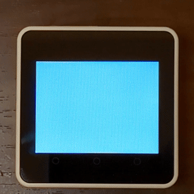

# Overview

The m5core2_voronoi project is an interactive Voronoi diagram renderer for the [M5Stack Core 2](https://docs.m5stack.com/#/en/core/core2) .

\[日本語\]

m5core2_voronoi プロジェクトは、インタラクティブにボロノイ図を描画する [M5Stack Core 2](https://docs.m5stack.com/#/en/core/core2) 用のソフトウェアです。

# Video




# Installation

1. Register an [M5Stack Community](https://community.m5stack.com/) account if you haven't already.
1. Launch the [M5Burner](https://docs.m5stack.com/en/download) .
1. Click `USER CUSTOM` in the lower left corner.
1. Log in to the M5Stack Community.
1. Click the `Share Burn` button.
1. Enter `15K4ORoKNNjBNYHw` in the `Share Code` field.
1. Click the lightning icon :zap: .

\[日本語\]

1. [M5Stack Community](https://community.m5stack.com/) のアカウントをまだ登録していない場合は登録してください。
1. [M5Burner](https://docs.m5stack.com/en/download) を起動します。
1. 左下隅の `USER CUSTOM` をクリックします。
1. M5Stack Communityにログインします。
1. `Share Burn` ボタンをクリックします。
1. `Share Code` フィールドに `15K4ORoKNNjBNYHw` と入力します。
1. 稲妻アイコン :zap: をクリックします。

# Installation for developers

1. Clone the repository:
    ```sh
    git clone https://github.com/cubic9com/m5core2_voronoi.git
    cd m5core2_voronoi
    ```

2. Install [Visual Studio Code](https://code.visualstudio.com/) if you haven't already.

3. Open the project in Visual Studio Code:
    ```sh
    code .
    ```

4. Install `PlatformIO IDE` extension:
    - Go to the Extensions view (`Ctrl+Shift+X`).
    - Search for `PlatformIO IDE` and install it.

5. Open PlatformIO Home:
    - In the left Activity Bar, click the PlatformIO icon.
    - In the left Primary Sidebar, Go to `QUICK ACCESS > PIO Home > Open`.

6. Open the project:
    - In the right Editor Groups, Click `Open Project` in the `PIO HOME` tab.
    - Select the cloned `m5core2_voronoi` project folder.

7. Upload the project:
    - In the left Primary Sidebar, go to `PROJECT TASKS > m5stack-core2 > General > Upload`.

\[日本語\]

1. リポジトリをクローンします:
    ```sh
    git clone https://github.com/cubic9com/m5core2_voronoi.git
    cd m5core2_voronoi
    ```

2. まだインストールしていない場合は、[Visual Studio Code](https://code.visualstudio.com/) をインストールします。

3. Visual Studio Code でプロジェクトを開きます:
    ```sh
    code .
    ```

4. `PlatformIO IDE` 拡張機能をインストールします:
    - 左サイドバーの「拡張機能」ビュー (`Ctrl+Shift+X`) を開きます。
    - `PlatformIO IDE` を検索してインストールします。

5. PlatformIO Home を開きます:
    - 左のアクティビティバーで PlatformIO アイコンをクリックします。
    - 左のメインサイドバーから `QUICK ACCESS > PIO Home > Open` を選択します。

6. プロジェクトを開きます:
    - 右のエディターグループ内の `PIO HOME` タブで `Open Project` をクリックします。
    - クローンした `m5core2_voronoi` プロジェクトフォルダーを選択します。

7. プロジェクトをアップロードします:
    - 左のメインサイドバーから `PROJECT TASKS > m5stack-core2 > General > Upload` を選択します。

# License

Copyright (C) 2025, cubic9com All rights reserved.

This project is licensed under the MIT license.

See file `LICENSE` file for details.

